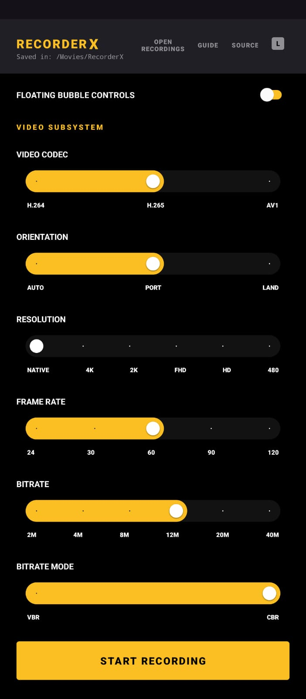
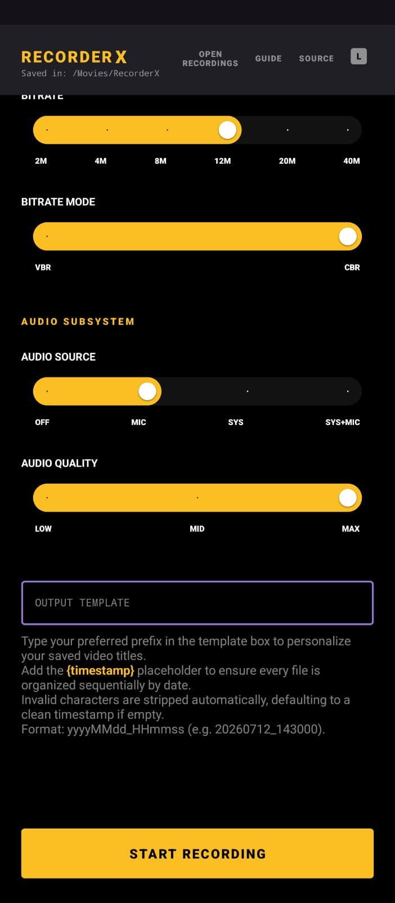
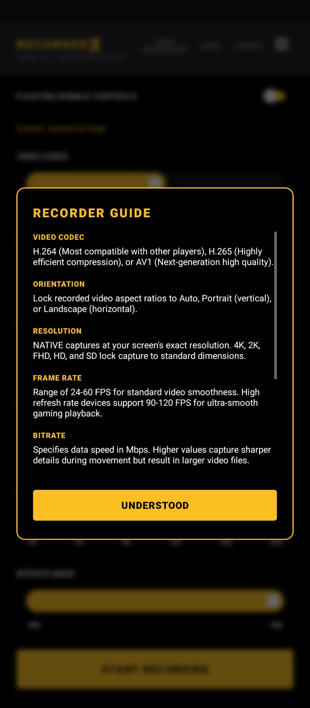
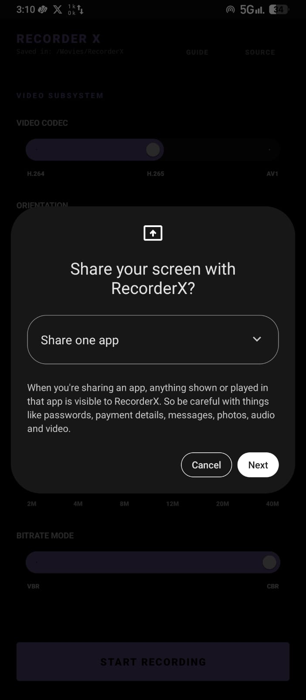

  <h1>RecorderX</h1>
  
A resilient, open-source recording solution featuring automated codec recovery and offline processing.

  
   

  
  
  
  

---
<h3>RecorderX is an application designed for high-fidelity screen capture.</h3>

## Versions

- v3.0.0 (Latest): Title Bar Swipe Gesture Theme Customizer (with custom onboarding and pulsing logo), Floating overlay controls, real-time screen brush tools, compact MediaStyle notification buttons, and compilation transition to Java 21.
- v2.0.1: Android 14 background activity compliance fixes.
- v2.0.0: Live-Reboot Watchdog, Encoder Fallback Mechanism, and System + Mic Audio Recording.
- v1.1.0: 4K/120FPS Support, AMOLED Lavender UI, and Live Thumbnail Notifications.
- v1.0.0: Initial stable release with H.264/HEVC support.

## Core Features

- High Resolution Capture: Support for 4K (UHD), 2K (QHD), and standard definitions.
- Enhanced Framerates: Native support for 90 FPS and 120 FPS recording modes.
- Advanced Codecs: Integrated support for H.264 (AVC), H.265 (HEVC), and AV1.
- Audio Management: Capture of Microphone, System audio, or both (Mic + System) simultaneously.
- Post-Capture Feedback: Automated thumbnail generation and system notification on session completion.
- Complete Privacy: Operates entirely offline with absolutely no internet permissions or telemetry.
- Floating Control Overlays: Access quick pause, resume, and stop recording actions floating over other applications.
- Screen Brush & Drawing Tool: Sketch and highlight directly on your screen while recording is active.
- Swipe-to-Recolor Theme Customizer: Instantly cycle between 12 distinct AMOLED-compatible neon accent colors by swiping left/right across the top title bar.
- Compact MediaStyle Notifications: Leverages custom text action drawing so control buttons remain functional and visible even in Android 14 collapsed/compact notification views.

## Advanced Capabilities

- Live-Reboot Watchdog: Features a self-healing encoder loop that seamlessly catches encoding failures and restarts the session internally, ensuring Android 14+ MediaProjection tokens are never invalidated.
- Custom ROM & GSI Compatibility: Bypasses faulty hardware checks found in standard Android environments, providing stable recording on spoofed or heavily modified custom ROMs.
- SoC Graceful Degradation: Automatically detects hardware bottlenecks (like AV1 encoding limits on weaker CPUs) and triggers encoder fallbacks without crashing the application.

<h3><b>Interface Gallery</b></h3>

 

  
  
  
  

## Technical Configuration

- Video Bitrate: Configurable up to 40 Mbps (CBR/VBR support).
- Audio Fidelity: Adjustable sample rates from 64kbps to 320kbps.
- Storage Path: All recordings are stored locally in `/Movies/RecorderX`.
- Naming Conventions: Support for custom filename templates using date and timestamp variables.

## Build Requirements

1. Clone: `git clone https://github.com/snap24/RecorderX.git`
2. Environment: Android Studio Koala+, JDK 21.
3. Target: Minimum SDK 29 (Android 10), Target SDK 34 (Android 14).
4. Execution: Run `./gradlew assembleRelease` for optimized production binaries.

## Available On

## License

This project is licensed under the Apache License 2.0. See [LICENSE](LICENSE) for details.

---

  Maintained by Chinmai H B

