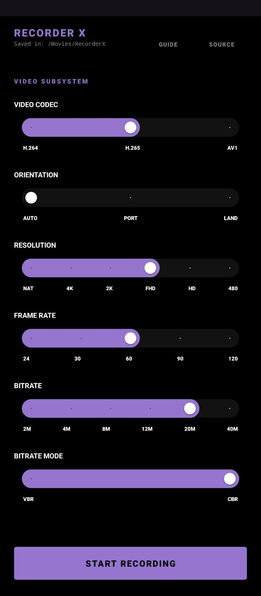
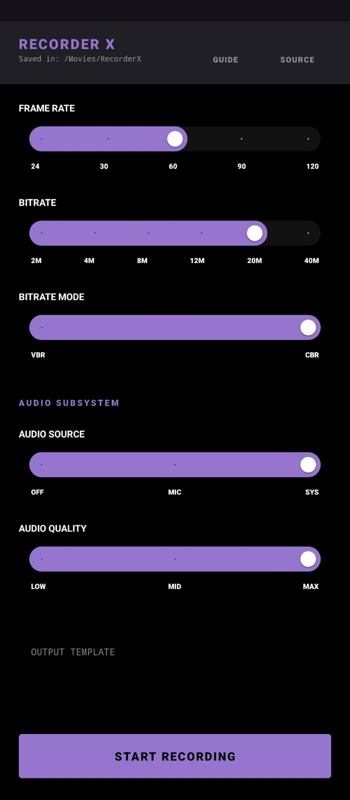
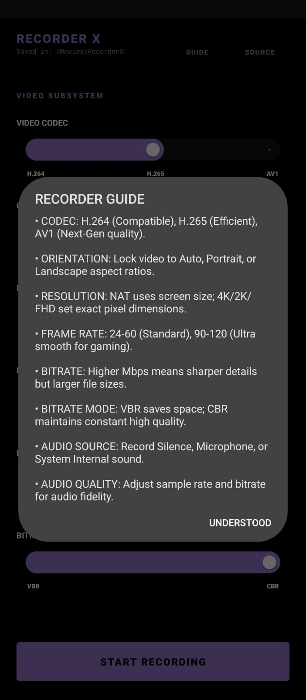

  
  <h1>RecorderX</h1>
  
<b>Peak Performance Screen Recording for Android</b>

  
  
  
  

---

A professional-grade, privacy-focused screen recorder built for power users. Optimized for AMOLED displays and high-refresh-rate gaming devices.

## 🚀 Key Features

- **⚡ Extreme Performance:** Record in **4K (UHD)** and **2K (QHD)** with ease.
- **🕹️ Gaming Optimized:** Native support for **90 FPS** and **120 FPS** recording.
- **🎨 Premium Aesthetic:** Modern **AMOLED Black** and **Deep Lavender** UI with precision Pill-Sliders.
- **🔊 Self-Healing Audio:** Automatically recovers and reconnects audio if the system blocks capture.
- **📸 Instant Feedback:** High-quality notifications with **live video thumbnails** after each recording.
- **📐 Orientation Lock:** Explicit Portrait and Landscape modes to prevent scaling distortion.
- **🔒 Privacy First:** Works **entirely offline**. No internet permission, no ads, no tracking.

<b>📸 View Screenshots (Click to Expand)</b>

 

  
  
  
  

## 🛠️ System Configuration

- **Codecs:** H.264 (AVC), H.265 (HEVC), and AV1.
- **Bitrate:** Up to 40 Mbps (CBR/VBR support).
- **Audio:** Adjustable quality from 64kbps to 320kbps (EX).
- **Naming:** Fully customizable file naming templates.

## 📥 Build Instructions

1. Clone the repository: `git clone https://github.com/zygisk-enc/RecorderX.git`
2. Open in **Android Studio** (Koala or newer recommended).
3. Ensure **minSdk 29** and **Java 17** are configured.
4. Run `./gradlew assembleRelease` to generate the high-performance APK.

## 📄 License

This project is licensed under the **Apache License 2.0**. See the [LICENSE](LICENSE) file for more details.

---

  Built with ❤️ by zygisk-enc

